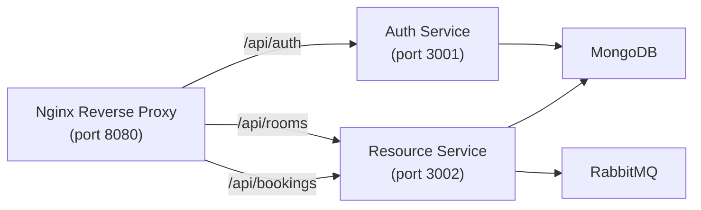

# Resource Services Backend

## Architecture Overview

This backend project includes:

- `auth-service` on port `3001`
- `resource-service` on port `3002`
- RabbitMQ for event publishing
- Nginx reverse proxy on port `8080`
- MongoDB for persistence

Services are exposed through the proxy as:

- `/api/auth` → Auth Service
- `/api/rooms` → Resource Service
- `/api/bookings` → Resource Service (booking events)

## Diagram



## Services

### Auth Service

- `POST /api/auth/register`
- `POST /api/auth/login`
- `GET /api/auth/profile`

Features:
- `User` schema
- `bcrypt` password hashing
- JWT generation and `authMiddleware`

### Resource Service

- `POST /api/rooms`
- `GET /api/rooms`
- `GET /api/rooms/:id`
- `PUT /api/rooms/:id`
- `DELETE /api/rooms/:id`
- `POST /api/bookings/confirm`
- `POST /api/bookings/cancel`

Features:
- `Room` schema with `available` / `maintenance`
- RabbitMQ event publication for booking events

## Docker Setup

### Run everything

```bash
docker compose up --build
```

### Services

- Auth Service: `http://localhost:3001`
- Resource Service: `http://localhost:3002`
- Nginx Proxy: `http://localhost:8080`
- RabbitMQ Management: `http://localhost:15672` (user: `guest`, pass: `guest`)
- MongoDB: `mongodb://localhost:27017`

## Notes

If you want to use the proxy, call endpoints like:

- `http://localhost:8080/api/auth/register`
- `http://localhost:8080/api/rooms`
- `http://localhost:8080/api/bookings/confirm`

## Startup

Each service uses `.env` variables exposed through Docker Compose.

## Deliverables

- `auth-service`
- `resource-service`
- `nginx/nginx.conf`
- `docker-compose.yml`
- Dockerfiles for backend services
